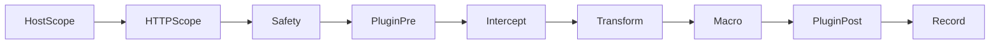
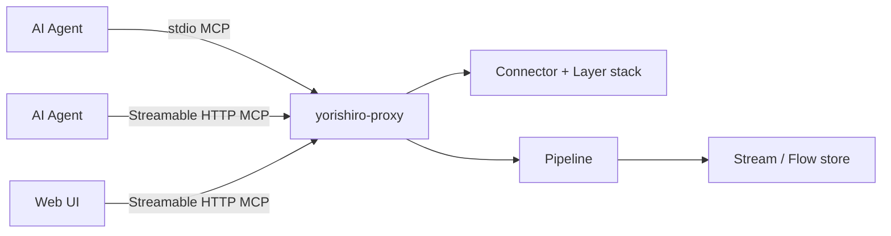

# Architecture

yorishiro-proxy is built on the **Envelope + Layered Connection Model** defined in RFC-001. Every connection is decomposed into a stack of `Layer`s; each Layer yields one or more `Channel`s; the Pipeline processes protocol-agnostic `Envelope`s drawn from those Channels. This page is the reference for the data model, the canonical pipeline, and how the pieces fit together.

## Design principles

### L7-first, L4-capable

1. **The default operation interface is a structured L7 view.** Communication is represented as protocol-native structured data (method, URL, headers, body, frames, events) so AI agents can reason about it without parsing bytes.
2. **Raw bytes recording, viewing, and modification are possible for every protocol.** As a diagnostic tool, the proxy must support protocol-level anomaly detection and reproduction. Pure transport protocols (e.g. SOCKS5) apply this principle to the tunneled inner protocol.
3. **L7 parsing is an overlay on top of raw bytes.** The wire-observed raw byte snapshot is never destroyed or modified. Mutations are always recorded as separate derived data (a *modified variant*) alongside the original.

### MCP-first control plane

Every operation is exposed as an MCP tool. There is no separate CLI command set or REST API. The Web UI itself is an MCP client over Streamable HTTP, indistinguishable from any other agent.

### No external proxy libraries

The proxy is built on Go's standard library plus a small set of approved dependencies. This eliminates version conflicts, reduces the attack surface, and gives full control over wire-level details that matter for security testing (header casing, header order, frame boundaries, smuggling-relevant byte sequences).

## Core data model

### Envelope

`Envelope` is the protocol-agnostic outer container that flows through the Pipeline. It carries identity, provenance, wire-fidelity raw bytes, and a typed `Message` payload.

```go
// internal/envelope/envelope.go
type Envelope struct {
    // Identity (shared across all protocols)
    StreamID  string
    FlowID    string
    Sequence  int
    Direction Direction // Send (client->server) or Receive (server->client)

    // Provenance
    Protocol Protocol // http, ws, grpc, grpc-web, sse, raw, tls-handshake

    // Wire fidelity (read-only view; authoritative bytes)
    Raw []byte

    // Protocol-specific structured view
    Message Message

    // Connection-scoped context (ConnID, ClientAddr, TLS snapshot, ...)
    Context EnvelopeContext

    // Layer-internal state; Pipeline must not type-assert on this
    Opaque any
}
```

Any field on `Envelope` must be meaningful for every protocol, including raw TCP. Protocol-specific fields belong on the `Message`.

### Message

`Message` is a small interface implemented by protocol-specific payload types. The Pipeline dispatches behavior by type-switching on `env.Message`.

```go
// internal/envelope/message.go
type Message interface {
    Protocol() Protocol
    CloneMessage() Message
}
```

Implementations:

| Type | Package file | Carries |
|------|--------------|---------|
| `HTTPMessage` | `internal/envelope/http.go` | Method, URL, status, ordered headers/trailers, body |
| `WSMessage` | `internal/envelope/ws.go` | Opcode, FIN/RSV bits, payload (per-message-deflate aware) |
| `GRPCStartMessage` | `internal/envelope/grpc.go` | Service/method, request metadata |
| `GRPCDataMessage` | `internal/envelope/grpc.go` | A single LPM-framed payload |
| `GRPCEndMessage` | `internal/envelope/grpc.go` | Status code, status message, trailers |
| `SSEMessage` | `internal/envelope/sse.go` | One `data:` event with id/event/retry |
| `RawMessage` | `internal/envelope/raw.go` | Opaque byte chunk |
| `TLSHandshakeMessage` | `internal/envelope/` | SNI, ALPN, JA3/JA4, peer certificate (observation-only) |

gRPC-Web reuses `HTTPMessage` for the outer request/response and surfaces wire-format anomalies (`AnomalyMalformedGRPCWebBase64`, `AnomalyMalformedGRPCWebLPM`, ...) when bodies fail to parse.

## Layer, Channel, ConnectionStack

A connection is an explicit **stack of Layers**, assembled per connection by `proxybuild.BuildLiveStack`. Each Layer wraps the bytes (or events) below it and exposes one or more **Channels**; the Pipeline runs on Envelopes drawn from those Channels.

The canonical stacks for live traffic are:

```
bytechunk → tlslayer → http1                                          → httpaggregator (HTTP/1 already aggregated)
bytechunk → tlslayer → http2  → httpaggregator                        (HTTP/2 with body buffering)
bytechunk → tlslayer → http1/http2 → grpc | grpcweb | ws | sse        (post-Upgrade or content-type dispatch)
bytechunk                                                             (raw TCP fallback)
```

Layer packages live under `internal/layer/`:

- `internal/layer/bytechunk/` — TCP byte-stream Layer (smuggling-safe pass-through).
- `internal/layer/tlslayer/` — TLS handshake termination + `TLSHandshakeMessage` synthesis.
- `internal/layer/http1/` — Custom HTTP/1.x parser; preserves header casing and order.
- `internal/layer/http2/` — Event-granular HTTP/2 frame engine.
- `internal/layer/httpaggregator/` — Folds HTTP/2 events into a single `HTTPMessage` per stream.
- `internal/layer/grpc/` — Native LPM reassembly producing `GRPCStart`/`Data`/`End` envelopes.
- `internal/layer/grpcweb/` — gRPC-Web (binary and base64 wire formats) over HTTP/1.x or HTTP/2.
- `internal/layer/ws/` — WebSocket framing with RFC 7692 per-message-deflate.
- `internal/layer/sse/` — Server-Sent Events (per-event envelopes, streaming-aware).

The `Layer` and `Channel` interfaces (`internal/layer/layer.go`, `internal/layer/channel.go`) are the only contract a new protocol implementation must satisfy.

## Canonical pipeline

The Pipeline is a fixed 8-step chain that runs on every Envelope. Plugin handling is split across two steps (`PluginPre` before Intercept, `PluginPost` after Macro), so the diagram shows nine boxes for one chain.



| Step | Source file | Purpose |
|------|-------------|---------|
| HostScope | `internal/pipeline/host_scope_step.go` | Drop envelopes outside the configured host scope |
| HTTPScope | `internal/pipeline/http_scope_step.go` | Apply HTTP-specific scope filters (path, method, content-type) |
| Safety | `internal/pipeline/safety_step.go` | Run Safety Filter Engine (input/output destructive-pattern + PII presets) |
| PluginPre | `internal/pipeline/plugin_step_pre.go` | Dispatch `(protocol, event, phase=pre)` Starlark hooks |
| Intercept | `internal/pipeline/intercept_step.go` | Hold queue + manual edit for matched envelopes |
| Transform | `internal/pipeline/transform_step.go` | Per-protocol auto-rewrite rules |
| Macro | `internal/pipeline/macro_step` (via job runner) | Macro engine: template / guard / extract / encoder |
| PluginPost | `internal/pipeline/plugin_step_post.go` | Dispatch `(protocol, event, phase=post)` hooks |
| Record | `internal/pipeline/record_step.go` | Persist Envelope (original + variant) to the Stream/Flow store |

Steps dispatch by type-switch on `env.Message`, so a step that only operates on HTTP traffic simply ignores envelopes whose `Message` is `WSMessage`, `GRPCDataMessage`, etc.

### Resend, Macro fan-out, synthesized Send

Replay paths do not re-run Safety, PluginPre, or Intercept. Resend, Macro fan-out, and any synthesized Send envelope traverse a shorter chain:

```
Transform → Macro → PluginPost → Record → Layer encode
```

This keeps replayed traffic from being re-held by interceptors and from re-firing pre-phase hooks that already ran on the original envelope. The Layer encode step at the tail is performed via the `WireEncoderRegistry` (`internal/pipeline/wire_encoder_registry.go`), which selects the per-protocol encoder for the outbound bytes.

## Per-protocol rule engines

Intercept, Transform, and Safety each consult per-protocol rule engines under `internal/rules/`:

- `internal/rules/common/` — HoldQueue, pattern compiler, shared presets.
- `internal/rules/http/` — Header / URL / body matchers and rewrites for `HTTPMessage`.
- `internal/rules/ws/` — Frame-level matchers for `WSMessage`.
- `internal/rules/grpc/` — Service/method matchers and metadata rewrites for `GRPCStart`/`Data`/`End`.

Pipeline Steps select the engine to consult by type-switching on `env.Message`. SSE and raw TCP envelopes fall through to the common matchers.

## Protocol coverage

| Protocol | L7 view | L4 raw bytes | Layer package |
|----------|---------|--------------|---------------|
| HTTP/1.x | YES | YES | `internal/layer/http1/` |
| HTTP/2 | YES | YES | `internal/layer/http2/` + `internal/layer/httpaggregator/` |
| gRPC | YES | YES (via H2) | `internal/layer/grpc/` |
| gRPC-Web | YES | YES | `internal/layer/grpcweb/` |
| WebSocket | YES | YES (per frame) | `internal/layer/ws/` |
| SSE | YES | YES | `internal/layer/sse/` |
| Raw TCP | N/A | YES (byte stream) | `internal/layer/bytechunk/` |
| TLS handshake | YES (observation) | N/A | `internal/layer/tlslayer/` |
| SOCKS5 | N/A (transport) | N/A | `internal/connector/socks5_handler.go` |

SOCKS5 is a transport: after the handshake completes, the inner connection re-enters protocol detection and is handled by the Layer stack appropriate for the tunneled protocol.

## Listener and stack assembly

The TCP entrypoint is `internal/connector/full_listener.go`. Multi-listener orchestration lives in `internal/connector/coordinator.go`. Per-connection plumbing — peek-based detection, ALPN routing, CONNECT tunnel handling, h2 dispatch — is split across `connector/detect.go`, `connector/alpn_routing.go`, `connector/connect_handler.go`, and `connector/h2_dispatch.go`.

`internal/proxybuild/` wires this all together: `BuildLiveStack` consumes a `Deps` struct and returns a runnable `Stack` that the `Manager` starts and stops via the `proxy_start` / `proxy_stop` MCP tools.

## Web UI and MCP transport

The proxy starts an HTTP MCP transport on a loopback port at boot, serving both the MCP API and the embedded Web UI on the same address. Use `-mcp-http-addr` to set a fixed address. The Web UI is a React/Vite single-page application that talks to the backend exclusively through MCP over Streamable HTTP — the same protocol used by AI agents.



The Web UI has the same capability surface as any MCP client. Multiple agents and the Web UI can share access simultaneously, authenticated by Bearer tokens.

## Related pages

- [Flows](flows.md) — Stream and Flow data model, recording lifecycle, variants
- [MCP-first design](mcp-first-design.md) — Why every operation is an MCP tool
- [Security model](security-model.md) — Two-layer security architecture, Safety Filter, scope
- [gRPC-Web](../protocols/grpc-web.md) — Binary and base64 wire format handling
