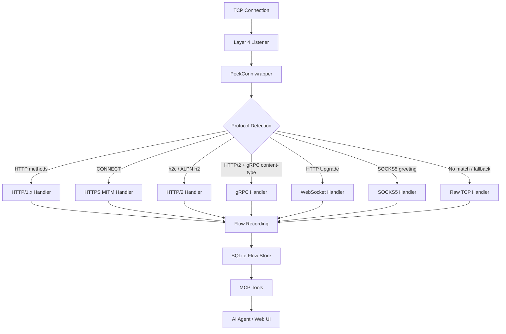
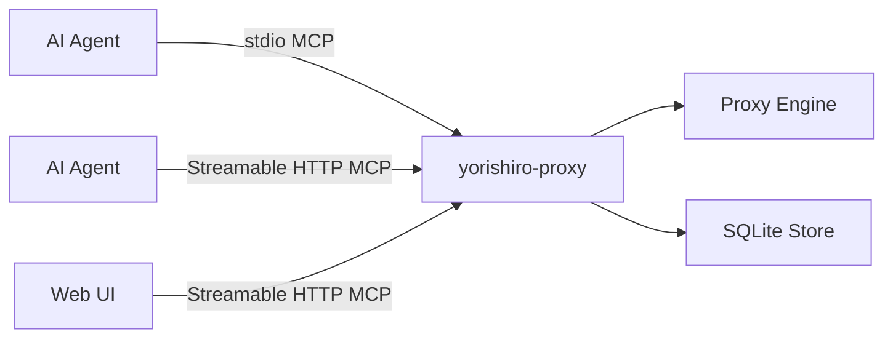

# Architecture

yorishiro-proxy is a Layer 4 TCP proxy that accepts raw connections, detects the protocol in use, and routes each connection to the appropriate protocol handler. This page explains the core architectural decisions and how data flows through the system.

## Design principles

Three principles guide the architecture:

1. **No external proxy libraries** -- The entire proxy is built on Go's standard library (`net`, `net/http`, `crypto/tls`). This eliminates version conflicts, reduces the attack surface, and gives full control over protocol handling details that matter for security testing (e.g., preserving raw bytes for smuggling analysis).

2. **Modular protocol handlers** -- Each protocol (HTTP/1.x, HTTPS, HTTP/2, gRPC, WebSocket, Raw TCP, SOCKS5) is implemented as a self-contained handler behind a common interface. Adding a new protocol requires implementing three methods without touching the listener or detection logic.

3. **MCP-first control plane** -- Every operation is exposed as an MCP tool. There is no separate CLI command set or REST API. The Web UI itself communicates with the backend through MCP over Streamable HTTP.

## Processing pipeline

The following diagram shows how a connection moves through the system:



## Layer 4 TCP listener

The listener (`internal/proxy/listener.go`) operates at the TCP level. When a new connection arrives, it:

1. **Wraps the connection** in a `PeekConn` -- a buffered wrapper that lets the proxy peek at the first bytes without consuming them from the stream.
2. **Applies a peek timeout** (default: 30 seconds) to protect against slowloris attacks. If no data arrives within the timeout, the connection is closed.
3. **Enforces a connection limit** (default: 128 concurrent connections) to bound memory usage. Connections exceeding the limit receive an immediate close.

The listener supports multiple instances running simultaneously on different ports, managed by the `Manager` (`internal/proxy/manager.go`). You can start and stop listeners independently through the `proxy_start` and `proxy_stop` MCP tools.

## Protocol detection

Protocol detection uses a two-stage peek strategy (`internal/protocol/detect.go`):

1. **Quick peek** (1 byte) -- Some protocols can be identified from a single byte. For example, SOCKS5 starts with byte `0x05`. This stage avoids blocking on protocols with short greetings.

2. **Full peek** (up to 16 bytes) -- If the quick peek does not match, the detector reads more bytes and runs each registered handler's `Detect()` method in priority order.

The `Detector` holds handlers in a defined priority order. The first handler whose `Detect(peek)` returns `true` wins:

| Priority | Protocol | Detection method |
|----------|----------|-----------------|
| 1 | SOCKS5 | First byte `0x05` |
| 2 | HTTP/1.x | Starts with an HTTP method (`GET`, `POST`, etc.) |
| 3 | HTTPS | `CONNECT` method in request line |
| 4 | HTTP/2 | h2c connection preface or ALPN negotiation |
| 5 | gRPC | HTTP/2 with gRPC content-type header |
| 6 | WebSocket | HTTP Upgrade header |
| 7 | Raw TCP | Fallback for unrecognized protocols |

## Protocol handler interface

Every protocol handler implements the `ProtocolHandler` interface:

```go
type ProtocolHandler interface {
    Name() string
    Detect(peek []byte) bool
    Handle(ctx context.Context, conn net.Conn) error
}
```

- `Name()` returns a human-readable protocol name (e.g., `"HTTP/1.x"`, `"gRPC"`)
- `Detect()` examines the peeked bytes and returns whether this handler can process the connection
- `Handle()` takes ownership of the connection and processes it according to the protocol

This interface makes the architecture extensible. The `HandlerBase` struct (`internal/proxy/handler_base.go`) provides shared functionality that protocol handlers embed: capture scope filtering, target scope enforcement, rate limiting, intercept engine integration, upstream proxy support, and TLS configuration.

## Supported protocols

| Protocol | Package | Flow type | Notes |
|----------|---------|-----------|-------|
| HTTP/1.x | `internal/protocol/http` | Unary | Forward proxy mode |
| HTTPS | `internal/protocol/http` | Unary | MITM with dynamic certificate issuance |
| HTTP/2 | `internal/protocol/http2` | Unary/Stream | Both h2c (cleartext) and h2 (TLS via ALPN) |
| gRPC | `internal/protocol/grpc` | Stream | Service/method extraction, streaming support |
| WebSocket | `internal/protocol/ws` | Bidirectional | Message-level recording per frame |
| Raw TCP | `internal/protocol/tcp` | Bidirectional | Captures any unrecognized protocol |
| SOCKS5 | `internal/protocol/socks5` | -- | Proxies through to inner protocol detection |

SOCKS5 is special: after the SOCKS5 handshake completes, the inner connection goes back through protocol detection, so a SOCKS5-tunneled HTTPS connection is handled by the HTTPS MITM handler. The flow is recorded with a `SOCKS5+` protocol prefix (e.g., `SOCKS5+HTTPS`).

## Flow recording

Every protocol handler records traffic as **flows** -- the fundamental data unit in yorishiro-proxy. A flow captures the complete lifecycle of a request/response exchange and is stored in SQLite. See [Flows](flows.md) for details on the flow model and lifecycle.

Recording uses a **progressive** pattern: the request (send) message is recorded before the upstream request is made, so even if the upstream fails, the request is preserved. The response (receive) message is recorded after the response has been relayed to the client.

## Web UI and MCP transport

When you enable Streamable HTTP mode (`-mcp-http-addr`), the proxy serves both the MCP API and the embedded Web UI on the same address. The Web UI is a React/Vite single-page application that communicates with the backend exclusively through MCP over Streamable HTTP -- the same protocol used by AI agents.



This means the Web UI has the same capabilities as any MCP client. Multiple agents and the Web UI can share access simultaneously, authenticated by Bearer tokens.

## Related pages

- [Flows](flows.md) -- The flow data model and lifecycle
- [MCP-first design](mcp-first-design.md) -- Why all operations are MCP tools
- [Security model](security-model.md) -- Two-layer security architecture
