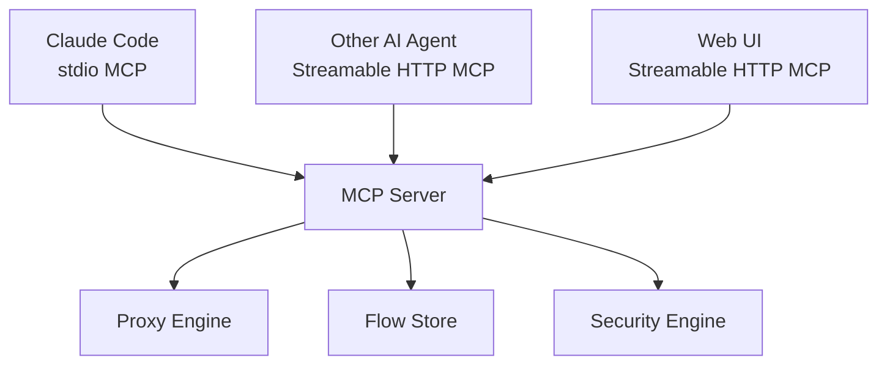

# MCP-first design

yorishiro-proxy is built around the principle that **every proxy operation is an MCP tool**. There is no separate CLI command set, no REST API, and no internal-only functions that are inaccessible to MCP clients. This page explains what MCP is, why this design was chosen, and how it shapes the tool's architecture.

## What is MCP?

[Model Context Protocol (MCP)](https://modelcontextprotocol.io/) is an open protocol that enables AI agents to interact with external tools and data sources through a standardized interface. An MCP server exposes **tools** (callable functions with typed parameters) that any MCP-compatible client can invoke.

yorishiro-proxy runs as an MCP server. When started, it listens for MCP tool calls and executes proxy operations in response. This means AI agents like Claude Code can directly start proxies, query captured traffic, replay requests, run fuzz campaigns, and configure security settings -- all through the same protocol they use for any other tool.

## Why MCP-first?

### AI agents as first-class users

Traditional proxy tools are designed for human operators using a GUI or CLI. yorishiro-proxy inverts this: the primary user is an AI agent performing automated security testing. The tool is designed so that an agent can:

1. Start a proxy and configure its scope
2. Analyze captured traffic patterns
3. Identify potential vulnerabilities
4. Replay and fuzz interesting requests
5. Evaluate results and adjust the testing strategy

All of this happens through structured MCP tool calls with JSON parameters and responses -- no screen scraping, no output parsing, no interactive prompts.

### Single interface for everything

By exposing all operations as MCP tools, there is exactly one way to do anything. The Web UI, AI agents, and any future integration all use the same interface:



This eliminates the common problem of having different capability levels across interfaces. The Web UI cannot do anything that an MCP tool call cannot, and vice versa.

### Structured input and output

Every tool has a JSON schema defining its parameters and return types. This gives AI agents precise knowledge of what each operation accepts and returns, enabling reliable automation without trial-and-error:

```json
// proxy_start
{
  "listen_addr": "127.0.0.1:8080",
  "capture_scope": {
    "includes": [{"hostname": "api.target.com"}]
  }
}
```

```json
// query
{
  "resource": "flows",
  "filter": {"method": "POST", "url_pattern": "/api/"},
  "limit": 10
}
```

## The eleven MCP tools

All proxy operations are organized into eleven tools, each handling a coherent set of related actions:

| Tool | Purpose |
|------|---------|
| `proxy_start` | Start a proxy listener with protocol, scope, and intercept configuration |
| `proxy_stop` | Graceful shutdown of one or all listeners |
| `configure` | Runtime configuration changes (scope, TLS passthrough, upstream proxy, etc.) |
| `query` | Unified information retrieval: flows, status, config, CA cert, intercept queue, macros, fuzz jobs |
| `resend` | Replay requests with mutations, raw byte replay, and structural diff comparison |
| `fuzz` | Automated payload injection with sequential/parallel modes |
| `macro` | Multi-step request sequences with variable extraction |
| `intercept` | Act on intercepted requests: release, modify, or drop |
| `manage` | Flow data management (delete, export, import) and CA regeneration |
| `security` | Target scope, rate limits, budgets, and SafetyFilter inspection |
| `plugin` | List, reload, enable, and disable Starlark plugins |

Many tools use an **action pattern** where a single tool handles multiple related operations. For example, `security` handles `set_target_scope`, `get_target_scope`, `test_target`, `set_rate_limits`, `get_rate_limits`, `set_budget`, `get_budget`, and `get_safety_filter` through its `action` parameter. This keeps the tool count manageable while covering a wide surface area.

## AI agent integration patterns

### Direct integration with Claude Code

The most common pattern is running yorishiro-proxy as a stdio MCP server in Claude Code's `.mcp.json`:

```json
{
  "mcpServers": {
    "yorishiro-proxy": {
      "command": "/path/to/yorishiro-proxy",
      "args": []
    }
  }
}
```

Claude Code communicates with the proxy over stdin/stdout using the MCP protocol. The agent has full control over starting the proxy, capturing traffic, and running security tests.

### Multi-agent shared access

When multiple agents need to work with the same proxy instance, you enable Streamable HTTP transport:

```json
{
  "mcpServers": {
    "yorishiro-proxy": {
      "command": "/path/to/yorishiro-proxy",
      "args": ["-mcp-http-addr", "127.0.0.1:3000"]
    }
  }
}
```

Other agents can then connect to `http://127.0.0.1:3000` using Streamable HTTP MCP with Bearer token authentication. Multiple agents can query flows, run fuzz campaigns, and inspect traffic simultaneously against the same proxy instance.

### Human + AI collaboration

The Web UI enables a collaborative workflow where a human operator and an AI agent work together:

1. The AI agent starts the proxy and runs automated scans
2. The human reviews findings in the Web UI
3. The human uses the Web UI's intercept feature to inspect suspicious requests
4. The AI agent adjusts its testing based on human guidance

Since both the Web UI and the AI agent use MCP, they share the same view of the proxy state. Changes made through the Web UI (like modifying an intercepted request) are immediately visible to the agent.

## Streamable HTTP transport

Streamable HTTP is the MCP transport used for networked access. Unlike stdio (which requires a direct process relationship), Streamable HTTP allows any HTTP client to make MCP tool calls:

- **Authentication**: Bearer token in the `Authorization` header (auto-generated or set via `-mcp-http-token`)
- **Shared state**: All clients see the same flows, configuration, and proxy state
- **Web UI co-hosting**: The embedded React/Vite Web UI is served from the same address

When you start the proxy with `-mcp-http-addr 127.0.0.1:3000`, the startup log prints the access URL with the authentication token:

```
WebUI available url=http://127.0.0.1:3000/?token=<random-token>
```

## Design trade-offs

### Why not a REST API?

A REST API would require maintaining two interfaces (MCP + REST) with the same capabilities. By choosing MCP-only, there is one implementation, one set of tests, and one documentation surface. Any MCP client -- AI agent, Web UI, or custom script -- gets the full feature set automatically.

### Why not a CLI?

CLI commands are designed for human interaction: formatted output, flags, interactive prompts. MCP tools are designed for programmatic interaction: structured JSON in and out. Since the primary user is an AI agent, MCP is the natural fit. Humans interact through the Web UI, which provides a better visual experience than a CLI would.

## Related pages

- [Architecture](architecture.md) -- How MCP tools connect to the proxy engine
- [Security model](security-model.md) -- How the two-layer security model interacts with MCP tools
- [MCP tools overview](../tools/overview.md) -- Reference for all eleven MCP tools
