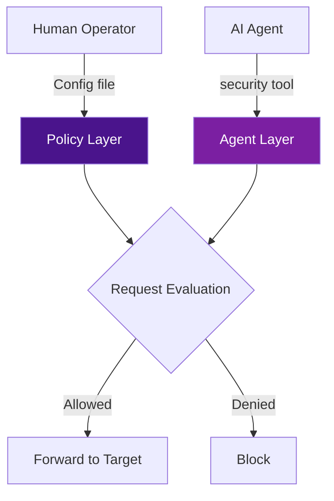

# Security model

yorishiro-proxy is designed for AI agents to perform automated security testing. This creates a fundamental tension: the agent needs enough freedom to test effectively, but must not be able to cause unintended damage. The security model resolves this with a **two-layer architecture** that separates human oversight from agent autonomy.

## The problem

When an AI agent controls a proxy tool for vulnerability assessment, several risks emerge:

- The agent might send destructive payloads (`DROP TABLE`, `rm -rf`) to production systems
- The agent might expand its scope beyond the intended target
- The agent might make too many requests and trigger rate limiting or service degradation
- The agent might accidentally exfiltrate sensitive data (PII, credentials) by including it in its responses

A fully locked-down system prevents effective testing. A fully open system is dangerous. The two-layer model provides a middle ground.

## Two-layer architecture

The security model consists of a **Policy Layer** and an **Agent Layer**:



### Policy Layer (human-controlled, immutable)

The Policy Layer is set by a human operator at startup through the configuration file or dedicated policy file. Once loaded, it **cannot be modified at runtime** -- not by MCP tools, not by the Web UI, not by any agent. It defines the absolute boundaries of what the proxy is allowed to do.

Policy Layer settings include:

- **Target scope allows/denies** -- which hosts, ports, paths, and schemes are permitted
- **Rate limits** -- maximum requests per second (global and per-host)
- **Diagnostic budgets** -- maximum total requests and session duration
- **SafetyFilter rules** -- regex patterns that block destructive payloads or mask PII

### Agent Layer (AI-controlled, mutable)

The Agent Layer is controlled by the AI agent through the `security` MCP tool at runtime. It can **further restrict** access within the Policy Layer boundaries, but it can never **expand** beyond them. If the Policy Layer allows `*.target.com`, the agent can narrow its scope to `api.target.com`, but it cannot add `other-domain.com`.

Agent Layer settings include:

- **Target scope allows/denies** -- additional restrictions within the policy boundary
- **Rate limits** -- equal or stricter limits than the policy
- **Diagnostic budgets** -- equal or stricter budgets than the policy

## Evaluation order

When a request passes through the proxy, the security model evaluates it in this order:

1. **Policy denies** -- If any Policy Layer deny rule matches, the request is always blocked (highest priority)
2. **Agent denies** -- If any Agent Layer deny rule matches, the request is blocked
3. **Policy allows** -- If Policy Layer has allow rules, the target must match at least one; otherwise it is blocked
4. **Agent allows** -- If Agent Layer has allow rules, the target must match at least one; otherwise it is blocked
5. **All checks passed** -- The request is forwarded to the target

When neither layer has any rules, the proxy operates in **open mode** -- all targets are permitted. As soon as any rule is configured in either layer, the mode changes to **enforcing**.

## Applied to: target scope

Target scope controls which network destinations the proxy can reach. Each rule specifies a combination of hostname (with optional wildcard), ports, path prefix, and schemes. All specified fields must match for a rule to apply (AND logic).

### Policy Layer example (config file)

```json
{
  "target_scope_policy": {
    "allows": [
      {"hostname": "*.target.com"}
    ],
    "denies": [
      {"hostname": "*.internal.corp"}
    ]
  }
}
```

This policy allows any subdomain of `target.com` and blocks all internal corporate hosts. These rules are locked at startup.

### Agent Layer example (runtime)

```json
// security
{
  "action": "set_target_scope",
  "params": {
    "allows": [
      {"hostname": "api.target.com", "ports": [443], "schemes": ["https"]}
    ],
    "denies": [
      {"hostname": "admin.target.com"}
    ]
  }
}
```

The agent narrows its scope to only `api.target.com` on port 443 over HTTPS, and additionally blocks `admin.target.com`. If the agent tried to add `{"hostname": "other-domain.com"}` to its allows, the operation would be rejected because `other-domain.com` falls outside the Policy Layer's `*.target.com` boundary.

### Dry-run testing

You can test whether a URL would be allowed without making a request:

```json
// security
{
  "action": "test_target",
  "params": {
    "url": "https://api.target.com/v1/users"
  }
}
```

The response reports whether the URL is allowed, which layer and rule made the decision, and the parsed target components.

## Applied to: rate limits

Rate limits prevent the proxy from overwhelming target systems. They follow the same two-layer pattern:

| Setting | Policy Layer | Agent Layer |
|---------|-------------|-------------|
| Global RPS | Set in config file | Can set equal or lower |
| Per-host RPS | Set in config file | Can set equal or lower |

When a request exceeds the rate limit, the proxy responds with `429 Too Many Requests` and an `X-Blocked-By: rate_limit` header.

```json
// security
{
  "action": "set_rate_limits",
  "params": {
    "max_requests_per_second": 10,
    "max_requests_per_host_per_second": 5
  }
}
```

If the Policy Layer sets a global limit of 50 RPS, the agent cannot set 100 RPS -- only 50 or lower.

## Applied to: diagnostic budgets

Budgets limit the total scope of a testing session:

| Setting | Description |
|---------|-------------|
| `max_total_requests` | Maximum number of requests in the session |
| `max_duration` | Maximum session duration (e.g., `"30m"`, `"2h"`) |

When a budget is exhausted, the proxy stops accepting new requests. The `get_budget` action reports the current usage:

```json
// security
{
  "action": "get_budget"
}
```

The response includes `request_count` (requests made so far) and `stop_reason` (non-empty when a budget is exhausted).

## Applied to: SafetyFilter

SafetyFilter is a **Policy Layer only** mechanism -- it cannot be modified at runtime. It provides two types of protection:

### Input filter

The input filter inspects outgoing requests (body, URL, query string, headers) against regex rules and blocks or logs matches before they reach the target. Built-in presets cover common destructive patterns:

| Preset | Description |
|--------|-------------|
| `destructive-sql` | DROP TABLE/DATABASE, TRUNCATE, DELETE without WHERE, etc. |
| `destructive-os-command` | rm -rf, shutdown/reboot, mkfs, dd if=, etc. |

When a request is blocked, the proxy returns `403 Forbidden` with an `X-Block-Reason: safety_filter` header and a JSON body containing the violation details.

### Output filter

The output filter masks sensitive data (PII) in responses before returning them to AI agents. The raw data is always preserved in the flow store for human review via the Web UI. Built-in presets include:

| Preset | Description |
|--------|-------------|
| `credit-card` | Credit card numbers (with Luhn validation for continuous format) |
| `email` | Email addresses |
| `japan-phone` | Japanese phone numbers (mobile and landline) |
| `japan-my-number` | Japanese My Number (with check digit validation) |

This design ensures that AI agents never see raw PII in their responses, while human operators can still review the original data through the Web UI.

### Configuration example

```json
{
  "safety_filter": {
    "enabled": true,
    "input": {
      "action": "block",
      "rules": [
        {"preset": "destructive-sql"},
        {"preset": "destructive-os-command"}
      ]
    },
    "output": {
      "action": "mask",
      "rules": [
        {"preset": "credit-card"},
        {"preset": "email"}
      ]
    }
  }
}
```

You can verify the active rules at runtime with the `get_safety_filter` action, but you cannot change them.

## Why two layers?

The two-layer design solves a specific problem: **AI agents need autonomy within safe boundaries**.

- **Without the Policy Layer**, an agent could remove all restrictions and access any target. A misconfigured or adversarially prompted agent would have no guardrails.

- **Without the Agent Layer**, every scope change would require restarting the proxy with a new config file. The agent could not adapt its testing strategy during a session.

The combination gives you:

- **Human oversight**: The operator defines what is safe before the agent starts
- **Agent flexibility**: The agent can focus its testing within the safe boundary
- **Auditability**: Both layers are visible through `get_target_scope`, so you can see exactly what is allowed and why
- **Fail-safe**: If the agent misbehaves, the Policy Layer prevents damage

## Related pages

- [Architecture](architecture.md) -- How the security model fits into the processing pipeline
- [MCP-first design](mcp-first-design.md) -- How security settings are managed through MCP tools
- [Target scope](../features/target-scope.md) -- Detailed guide for configuring target scope
- [SafetyFilter](../features/safety-filter.md) -- Detailed guide for SafetyFilter configuration
- [Rate limits & budgets](../features/rate-limits.md) -- Detailed guide for rate limits and budgets
