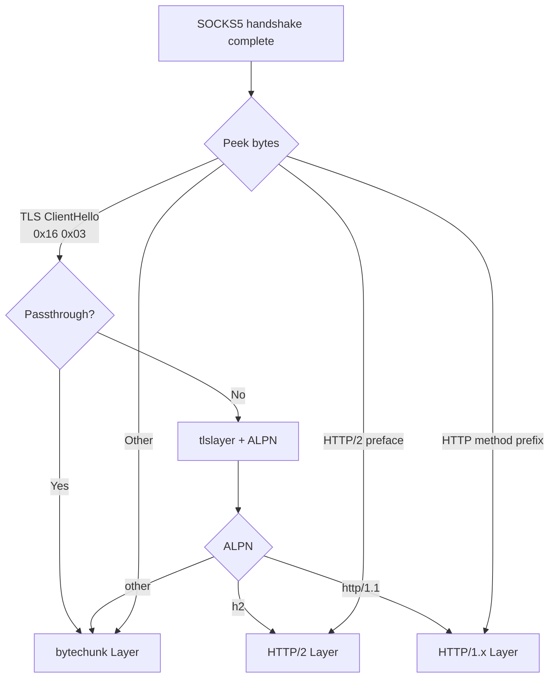

# SOCKS5

yorishiro-proxy includes a built-in SOCKS5 proxy (RFC 1928) that enables routing arbitrary TCP traffic through the proxy. This is particularly useful with tools like `proxychains` that can redirect any program's network traffic through a SOCKS5 proxy.

SOCKS5 is a transport — not an application Layer. The handshake lives in the connector (`internal/connector/socks5_handler.go`), not under `internal/layer/`. Once the SOCKS5 CONNECT completes, the connector runs the same protocol detection it uses on a direct listener, so the post-handshake byte stream is wrapped in whichever Layer matches (HTTP/1.x, HTTP/2 over TLS via `tlslayer/`, or `bytechunk/`).

## SOCKS5 handshake

The connector implements the SOCKS5 protocol as defined in RFC 1928 and RFC 1929:

### Detection

SOCKS5 connections are identified by the first byte: `0x05` (the SOCKS version number). The connector uses a quick single-byte peek for fast detection, avoiding the latency of waiting for more bytes.

### Method negotiation

```
Client                              Proxy
  |                                   |
  |── Version(0x05) + Methods ──────>|
  |                                   |  Select method
  |<── Version(0x05) + Method ───────|
  |                                   |
```

The proxy supports two authentication methods:

| Method | Code | Description |
|--------|------|-------------|
| NO AUTH | `0x00` | No authentication required |
| USERNAME/PASSWORD | `0x02` | RFC 1929 username/password authentication |

If an authenticator is configured, `USERNAME/PASSWORD` is preferred. If the client does not offer the required method, the proxy responds with `0xFF` (no acceptable methods) and closes the connection.

### Authentication (RFC 1929)

When `USERNAME/PASSWORD` is selected:

```
Client                              Proxy
  |                                   |
  |── AuthVer(0x01) + User + Pass ──>|
  |                                   |  Validate credentials
  |<── AuthVer(0x01) + Status ───────|
  |                                   |
```

Status `0x00` indicates success; `0x01` indicates failure (connection closed).

### CONNECT command

After authentication (or method negotiation if no auth), the client sends a CONNECT request:

```
Client                              Proxy
  |                                   |
  |── VER + CMD(0x01) + ATYP + DST ─>|
  |                                   |  Dial upstream
  |<── VER + REP + BND ──────────────|
  |                                   |
```

The proxy supports three address types:

| Type | Code | Format |
|------|------|--------|
| IPv4 | `0x01` | 4 bytes |
| Domain | `0x03` | 1 byte length + domain string |
| IPv6 | `0x04` | 16 bytes |

Only the `CONNECT` command (`0x01`) is supported. `BIND` and `UDP ASSOCIATE` return a "command not supported" error reply.

## Post-handshake protocol detection

After the SOCKS5 handshake completes, the connector runs the same detect logic it uses on a direct listener and builds a `ConnectionStack` accordingly:



1. **TLS ClientHello** (bytes `0x16 0x03`): if the target is in the passthrough list, the connector wires `bytechunk/` for opaque relay. Otherwise, the connector closes the pre-established upstream connection and runs the standard CONNECT-style flow: `tlslayer/` for client + upstream, ALPN routing for the inner Layer.

2. **HTTP method prefix**: the connector wires the [HTTP/1.x](http.md) Layer. The SOCKS5 target is stored in the context so the Layer can reconstruct absolute URLs.

3. **Other traffic**: the connector falls through to the `bytechunk/` Layer.

## Username/password authentication

Configure SOCKS5 authentication via the `configure` tool:

```json
// configure
{
  "socks5_auth": {
    "method": "password",
    "username": "user",
    "password": "pass"
  }
}
```

Per-listener authentication is also supported -- you can configure different credentials for different SOCKS5 listeners.

## Recorded envelopes

`Envelope.Protocol` reflects the inner Layer (e.g. `http`, `ws`, `grpc`, `raw`) — SOCKS5 itself is a transport, not a Message protocol. The original SOCKS5 CONNECT target and authentication state ride on flow tags / context:

| Tag | Description |
|-----|-------------|
| `socks5_target` | The original SOCKS5 CONNECT target (e.g., `example.com:443`) |
| `socks5_auth_method` | `none` or `username_password` |
| `socks5_auth_user` | The authenticated username (if auth was used) |

## Using with proxychains

### Step 1: Start the SOCKS5 listener

```json
// proxy_start
{
  "listen_addr": "127.0.0.1:1080",
  "protocol": "socks5"
}
```

### Step 2: Configure proxychains

Edit `/etc/proxychains.conf` (or `~/.proxychains/proxychains.conf`):

```ini
[ProxyList]
socks5 127.0.0.1 1080
```

With authentication:

```ini
[ProxyList]
socks5 127.0.0.1 1080 user pass
```

### Step 3: Route traffic

```bash
proxychains curl https://httpbin.org/get
proxychains nmap -sT -p 80,443 target.example.com
```

All TCP traffic from the proxied command flows through yorishiro-proxy. HTTPS traffic is intercepted (MITM) and recorded. Plaintext HTTP is also recorded.

### Step 4: Query SOCKS5-tunneled flows

Filter by the inner Layer's protocol (e.g. `http` for HTTPS-via-SOCKS5) and use the `socks5_target` flow tag to scope to a specific tunnel target:

```json
// query
{
  "resource": "flows",
  "filter": {"protocol": "http"}
}
```

## Plugin hooks

The SOCKS5 handler dispatches the `(socks5, on_connect)` lifecycle hook after a successful SOCKS5 CONNECT and **before** the connector builds the inner ConnectionStack. A `DROP` action returned from this hook closes the tunnel before any inner Layer is wired up. See the [Plugin hook reference](../plugins/hook-reference.md) for the full surface.

## Target scope and rate limiting

The SOCKS5 negotiator enforces target scope and rate limit rules before establishing the upstream connection. If a target is blocked by scope rules, the negotiator responds with SOCKS5 reply code `0x02` (connection not allowed by ruleset). Rate-limited targets also receive the same error reply.

## Limitations

- **CONNECT only** -- `BIND` (0x02) and `UDP ASSOCIATE` (0x03) commands are not supported
- **No GSSAPI** -- only NO AUTH and USERNAME/PASSWORD authentication methods are supported
- **Single hop** -- the SOCKS5 proxy does not support chaining through another SOCKS5 proxy

## Related pages

- [HTTPS MITM](https-mitm.md) -- TLS interception through SOCKS5 tunnels
- [HTTP/1.x](http.md) -- plaintext HTTP through SOCKS5
- [Raw TCP](raw-tcp.md) -- fallback relay for unrecognized protocols
- [proxychains guide](../guides/proxychains.md) -- detailed proxychains setup guide
- [Plugin hook reference](../plugins/hook-reference.md) -- `on_socks5_connect` hook details
