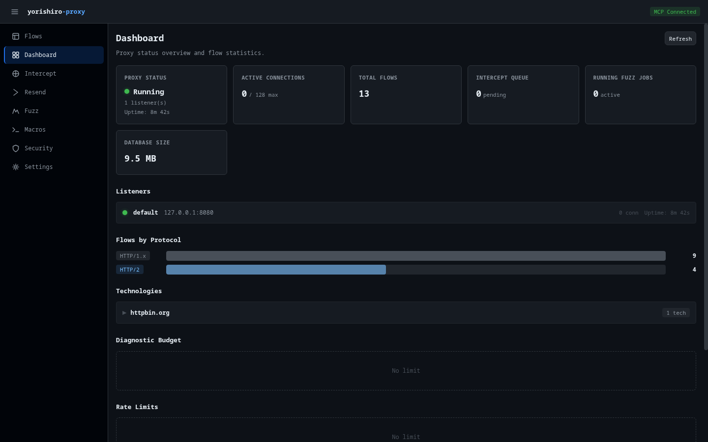

# Dashboard

The Dashboard page provides a real-time overview of proxy status, traffic statistics, and operational metrics. All widgets auto-refresh every 5 seconds.

## Summary cards

The top of the dashboard displays six summary cards:

### Proxy status

Shows whether the proxy is **Running** or **Stopped**, along with the listener count and uptime when running.

### Active connections

Displays the current number of active connections against the configured maximum (e.g., "12 / 1000 max").

### Total flows

Shows the total count of captured flows across all protocols.

### Intercept queue

Displays the number of requests pending in the intercept queue. The count highlights in yellow when items are waiting.

### Running fuzz jobs

Shows the number of currently active fuzz campaigns. The count highlights in blue when jobs are running.

### Database size

Displays the current size of the flow database (formatted as B, KB, MB, or GB).

## Listeners

When the proxy is running, the Listeners section shows each active listener with:

- Listener name and listen address
- Active connection count
- Uptime

## TCP forwards

If TCP port forwarding rules are configured, this section displays each mapping as a visual arrow from the local port to the upstream target (e.g., `:3306 -> db.internal:3306`).

## Flows by protocol

A horizontal bar chart breaks down captured flows by protocol. Each protocol gets a color-coded bar with a count:

- **HTTP/1.x** -- Default (gray)
- **HTTPS** -- Green
- **WebSocket** -- Blue
- **HTTP/2** -- Blue
- **gRPC** -- Yellow
- **TCP** -- Red

Only protocols with at least one captured flow are shown.

## Technologies

The Technologies widget displays detected web technologies grouped by host. When multiple hosts are detected, a filter input lets you search by hostname. Each host entry is an expandable accordion showing:

- **Technology name** and optional version
- **Category** -- Server, Framework, Language, CMS, CDN, WAF, JS Framework
- **Confidence level** -- High, Medium, or Low (color-coded badge)

Technologies are grouped by category within each host for easy scanning.

## Diagnostic budget

The Budget widget shows diagnostic budget usage when budget limits are configured:

- **Request usage** -- Progress bar showing requests used vs. maximum allowed, with color changes at 80% (warning) and 95% (danger)
- **Duration limit** -- Maximum session duration if configured
- **Stop reason** -- Displayed when the proxy has been stopped due to budget exhaustion

When no budget limits are set, the widget shows "No limit".

## Rate limits

The Rate Limit widget displays the effective rate limiting configuration:

- **Global RPS** -- Maximum requests per second across all targets
- **Per-Host RPS** -- Maximum requests per second to any single host

When no rate limits are configured, the widget shows "No limit".

## Configuration

The Configuration section at the bottom summarizes key proxy settings:

| Setting | Description |
|---------|-------------|
| Listen address | Address the proxy is listening on |
| Upstream proxy | Upstream proxy URL or "Direct" |
| Max connections | Maximum concurrent connections |
| Peek timeout | Protocol detection timeout (ms) |
| Request timeout | HTTP request timeout (ms) |
| CA initialized | Whether the TLS CA certificate is ready |

## Related pages

- [Settings](settings.md) -- Configure proxy settings
- [Security](security.md) -- Manage rate limits and budgets
- [Technology detection](../features/technology-detection.md) -- How technology detection works
