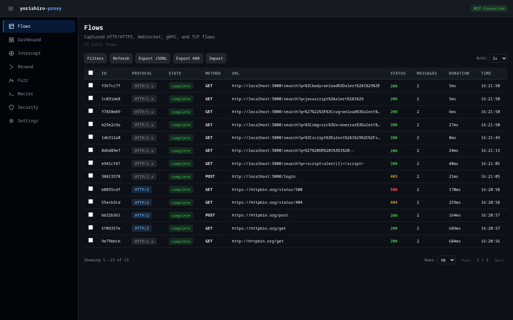

# Flows

The Flows page is the primary interface for browsing captured network traffic. It displays all HTTP/1.x, HTTPS, WebSocket, HTTP/2, gRPC, and TCP flows in a paginated, filterable table.

## Flow list

The main table shows one row per captured flow with the following columns:

| Column | Description |
|--------|-------------|
| **ID** | First 8 characters of the flow's unique identifier |
| **Protocol** | Color-coded badge (HTTP/1.x, HTTPS, WebSocket, HTTP/2, gRPC, TCP) |
| **State** | `active`, `complete`, or `error` |
| **Method** | HTTP method (GET, POST, etc.) or blank for non-HTTP protocols |
| **URL** | Full request URL |
| **Status** | HTTP response status code, color-coded by class (2xx/3xx/4xx/5xx) |
| **Messages** | Message count (relevant for WebSocket and TCP flows) |
| **Duration** | Request-response round-trip time |
| **Time** | Timestamp when the flow was captured |

Click any row to navigate to the flow detail view.

## Filtering

Click the **Filters** button in the toolbar to reveal the filter panel. You can filter by:

- **Protocol** -- Radio buttons for HTTP/1.x, HTTPS, WebSocket, HTTP/2, gRPC, TCP, or All
- **Method** -- Dropdown for GET, POST, PUT, DELETE, PATCH, HEAD, OPTIONS
- **Status** -- Dropdown for specific status codes (200, 301, 400, 500)
- **Flow state** -- Dropdown for active, complete, or error
- **URL pattern** -- Text input with debounced search (300ms delay)
- **Body contains** -- Text search within response bodies
- **Tag** -- Filter by flow tag

Filters are applied in combination. When any text filter changes, the pagination resets to page 1 automatically.

## Auto-refresh

The flow list supports configurable auto-refresh polling. Use the **Auto** dropdown in the toolbar to set the polling interval:

- Off (manual refresh only)
- 1s, 2s, 5s, or 10s

The default polling interval is 2 seconds. You can also click **Refresh** to manually reload the list.

## Sorting

Click the **Duration** or **Time** column headers to sort the flow list by that field. Click again to clear the sort. A downward arrow indicator appears next to the active sort column.

## Selecting flows

Each row has a checkbox for multi-select. Use the header checkbox to toggle select-all for the current page. When flows are selected, a bulk actions bar appears with the following options:

- **Export HAR** -- Export selected flows as a HAR file
- **Delete** -- Delete selected flows (with confirmation dialog)
- **Clear** -- Clear the selection

## Flow detail view

Clicking a flow row navigates to the detail page (`/flows/{id}`), which shows the full request and response data. The detail view includes:

- **Request headers** -- Displayed in a key-value table
- **Request body** -- With syntax-highlighted viewer
- **Response headers** -- Displayed in a key-value table
- **Response body** -- With content-type-aware rendering
- **Connection info** -- TLS version, server address, timing data

For HTTP/2 and gRPC flows, the detail view also shows pseudo-headers (`:method`, `:path`, `:authority`, `:scheme`) and stream information.

For WebSocket flows, a message list shows individual frames with direction indicators (send/receive), timestamps, and payload content.

### Export options

From the detail view, you can:

- **Copy as cURL** -- Generate a cURL command that reproduces the request
- **Export HAR** -- Download the flow as a single-entry HAR file
- **Resend** -- Navigate to the Resender page with the flow pre-loaded

## Exporting flows

The toolbar provides two export options:

- **Export JSONL** -- Exports all flows (server-side) as a JSONL file via the `manage` tool with `export_flows` action
- **Export HAR** -- Downloads selected flows (or all visible flows if none selected) as a HAR file directly in the browser

## Importing flows

Click **Import** to open the import dialog. You can import flows from a JSONL file stored on the server:

1. Enter the server-side file path (e.g., `/path/to/flows.jsonl`)
2. Choose a conflict policy:
    - **Skip** -- Keep existing flows when IDs conflict
    - **Replace** -- Overwrite existing flows
3. Click **Import**

The dialog displays import results including counts of imported, skipped, and errored entries.

## Pagination

Below the table, pagination controls let you:

- Navigate between pages with **Prev** / **Next** buttons
- See the current page position (e.g., "1 / 5")
- Change the number of rows per page (25, 50, or 100)
- See the total flow count and current range

## Related pages

- [Concepts: Flows](../concepts/flows.md) -- Understanding the flow data model
- [Flow export & import](../features/flow-export-import.md) -- Detailed export/import documentation
- [query tool](../tools/query.md) -- MCP tool used by this page
