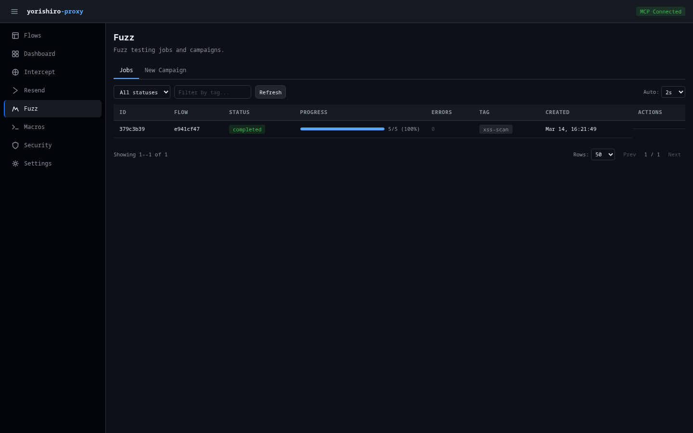

# Fuzzer

The Fuzzer page lets you create, manage, and monitor fuzz testing campaigns. You can define payload positions, configure payload sets, control execution parameters, and analyze results -- all from the Web UI.

## Tabs

The page has two tabs:

- **Jobs** -- List of all fuzz campaigns with status and controls
- **New Campaign** -- Form for creating a new fuzz campaign

## Jobs list

The Jobs tab displays a paginated table of all fuzz campaigns:

| Column | Description |
|--------|-------------|
| **ID** | First 8 characters of the fuzz job ID |
| **Flow** | First 8 characters of the base flow ID |
| **Status** | Color-coded badge: running (blue), completed (green), paused (yellow), cancelled/error (red) |
| **Progress** | Visual progress bar with percentage and count (e.g., "150/500 (30%)") |
| **Errors** | Error count, highlighted in red when non-zero |
| **Tag** | Optional campaign tag |
| **Created** | Creation timestamp |
| **Actions** | Control buttons based on current status |

### Job actions

The available actions depend on the job's status:

| Status | Available actions |
|--------|-------------------|
| **Running** | Pause, Cancel |
| **Paused** | Resume, Cancel |
| **Completed** | (none) |
| **Cancelled** | (none) |
| **Error** | (none) |

### Toolbar

The toolbar provides:

- **Status filter** -- Dropdown to filter by job status (running, completed, paused, cancelled, error)
- **Tag filter** -- Text input to filter by tag
- **Refresh** -- Manual refresh button
- **Auto-refresh** -- Polling interval selector (Off, 1s, 2s, 5s). Default is 2 seconds.

Click any job row to navigate to the results page for that campaign.

## Creating a campaign

The **New Campaign** tab provides a comprehensive form for configuring a fuzz campaign.

### Base flow

Enter the **Flow ID** of the captured request to use as the base for fuzzing.

### Campaign settings

- **Attack type** -- Choose between:
    - **Sequential** -- Test each position one at a time
    - **Parallel** -- Test all positions simultaneously
- **Tag** -- Optional label for the campaign

### Payload positions

Define where in the request to inject payloads. Click **Add Position** to add more. Each position has:

- **ID** -- Unique identifier for this position (e.g., `pos-1`)
- **Location** -- Where to inject: Header, Path, Query, Body (Regex), Body (JSON), or Cookie
- **Match pattern** -- Pattern to find and replace (e.g., `FUZZ`)
- **Payload set** -- Name of the payload set to use for this position (e.g., `set-1`)
- **JSON Path** -- Only shown when location is "Body (JSON)"; specifies the JSON path (e.g., `$.key`)

### Payload sets

Define the payloads to inject at each position. Click **Add Payload Set** to add more. Each set has:

- **Name** -- Unique name referenced by positions (e.g., `set-1`)
- **Type** -- One of:
    - **Wordlist (values)** -- Enter payloads directly, one per line
    - **Range (numeric)** -- Specify start, end, and step values for numeric sequences
    - **File** -- Path to a wordlist file on the server

### Execution parameters

- **Concurrency** -- Number of parallel requests (default: 1)
- **Rate limit (RPS)** -- Maximum requests per second (blank for unlimited)
- **Delay (ms)** -- Delay between requests in milliseconds
- **Timeout (ms)** -- Request timeout in milliseconds (default: 30000)

### Stop conditions

Optional conditions to automatically stop the campaign:

- **Error count** -- Stop after this many errors
- **Stop status codes** -- Comma-separated status codes that trigger a stop (e.g., `500,503`)
- **Latency threshold (ms)** -- Stop when response latency exceeds this value

### Hooks

When macros are defined, a Hooks section allows attaching pre-send and post-receive hooks to the fuzz campaign.

### Starting the campaign

Click **Start Fuzz Campaign** to begin. You are automatically switched to the Jobs tab to monitor progress.

## Results page

Click a job row to navigate to the results detail page (`/fuzz/{id}`).

### Job stats

The top of the results page shows:

- **Status** -- Current job status badge
- **Progress** -- Visual progress bar with percentage
- **Errors** -- Error count
- **Avg duration** -- Average response time across all results
- **Status distribution** -- Breakdown of response status codes (e.g., "200: 450, 404: 30, 500: 20")
- **Tag** -- Campaign tag if set

Job control buttons (Pause/Resume/Cancel) appear in the header for active jobs.

### Results table

A filterable, paginated table shows individual fuzz results:

| Column | Description |
|--------|-------------|
| **#** | Result index number |
| **Status** | Response status code, color-coded |
| **Length** | Response body length |
| **Duration** | Response time |
| **Payloads** | Key-value pairs showing which payload was used at each position |
| **Error** | Error message if the request failed (truncated to 40 characters) |

### Filtering and sorting

- **Status code** -- Filter by specific status code
- **Body contains** -- Search within response bodies
- **Sort** -- Sort by status code, duration, or body length

Results auto-refresh every 2 seconds for active jobs and stop polling for completed jobs.

### Result detail panel

Click a result row to open the detail panel showing:

- **Payloads** -- Full payload key-value pairs used for this request
- **Error** -- Full error message if applicable
- **Response headers** -- Complete response header listing
- **Response body** -- Full response body with content-type-aware syntax highlighting

## Related pages

- [Fuzzer feature](../features/fuzzer.md) -- Detailed fuzzer documentation
- [fuzz tool](../tools/fuzz.md) -- MCP tool reference
