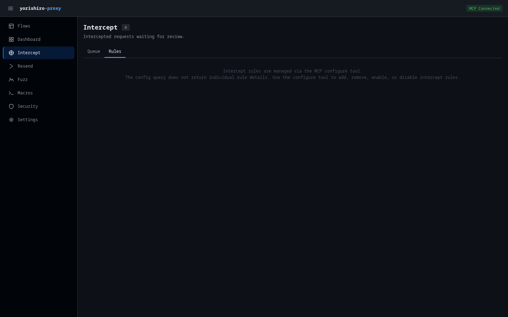

# Intercept

The Intercept page lets you review, modify, and control intercepted requests, responses, and WebSocket frames that match your intercept rules. It operates as a queue where you can inspect each intercepted item and decide what to do with it.

## Tabs

The page has two tabs:

- **Queue** -- Shows intercepted requests, responses, and WebSocket frames waiting for your action
- **Rules** -- Displays information about intercept rule configuration

## Intercept queue

The Queue tab displays a table of all currently intercepted items. The queue polls every second for new entries. Each row shows:

| Column | Description |
|--------|-------------|
| **ID** | First 8 characters of the intercept entry ID |
| **Phase** | Color-coded badge indicating the intercept phase (see below) |
| **Method / Status** | HTTP method badge (for requests), status code (for responses), or opcode + direction (for WebSocket frames) |
| **URL** | Request path and query string, or upgrade URL for WebSocket frames |
| **Host** | Target hostname extracted from the URL |
| **Rules** | Badges showing which intercept rules matched this item |
| **Time** | Timestamp when the item was intercepted |

### Phase column

Each intercepted item has a phase that determines what kind of data it contains and how you can modify it:

| Phase | Badge color | Description |
|-------|-------------|-------------|
| `request` | Blue (info) | HTTP request before it is sent to the upstream server |
| `response` | Green (success) | HTTP response received from the upstream server, before it is returned to the client |
| `websocket_frame` | Yellow (warning) | A WebSocket data frame captured during an active WebSocket relay |

The page header shows a badge with the current queue count, highlighted in yellow when items are pending.

When the queue is empty, a message prompts you to configure intercept rules.

## Working with intercepted items

Click a row in the queue to select it. The detail panel opens below the queue table, showing editable fields appropriate to the item's phase.

### Request phase editing

When the selected item is a **request**, the detail panel provides inline editing for all request components:

- **Method** -- Dropdown to change the HTTP method (GET, POST, PUT, PATCH, DELETE, HEAD, OPTIONS)
- **URL** -- Text input to modify the full request URL
- **Headers** -- Key-value editor where you can:
    - Edit existing header names and values
    - Remove headers with the **x** button
    - Add new headers with **+ Add Header**
- **Body** -- Textarea for editing the request body

### Response phase editing

When the selected item is a **response**, the detail panel shows:

- **Status code** -- Dropdown to change the HTTP status code
- **URL** -- Read-only display of the original request URL
- **Headers** -- Key-value editor for response headers (same add/edit/remove controls as request headers)
- **Body** -- Textarea for editing the response body

The following parameters are sent when you modify and forward a response:

| Parameter | Description |
|-----------|-------------|
| `override_status` | HTTP status code override |
| `override_response_headers` | Replace existing response headers |
| `add_response_headers` | Add new response headers |
| `remove_response_headers` | Remove response headers by name |
| `override_response_body` | Replace the response body |

### WebSocket frame editing

When the selected item is a **websocket_frame**, the detail panel shows read-only metadata and an editable payload:

- **Opcode** -- Frame opcode badge (e.g., `Text`, `Binary`)
- **Direction** -- `client_to_server` or `server_to_client`
- **Flow ID** -- The WebSocket flow this frame belongs to
- **Upgrade URL** -- The URL from the original WebSocket upgrade request
- **Sequence** -- Frame sequence number within the connection
- **Body** -- Textarea for editing the frame payload

To modify a WebSocket frame, edit the body and click **Modify & Forward**. Only the `override_body` parameter is used for WebSocket frames.

### Structured and raw view modes

When raw bytes are available for an intercepted item, a **Structured / Raw** toggle appears at the top of the detail panel. This controls which view you see and which data is sent when you act on the item.

- **Structured** (default) -- Shows the parsed HTTP fields (method, URL, headers, body). Edits are applied at the HTTP (L7) layer.
- **Raw** -- Shows the captured wire bytes. Edits are applied at the byte level, bypassing HTTP serialization.

The active view mode determines what happens when you click **Modify & Forward**:

- In **Structured** view, your edits to method, URL, headers, and body are sent as structured L7 modifications.
- In **Raw** view, the edited raw bytes are sent as `raw_override_base64`, replacing the entire payload on the wire.

**Release** and **Drop** work the same in both views, except that Release in Raw view forwards the original wire bytes without HTTP library normalization.

### Raw bytes editor

When you switch to Raw view, the detail panel shows the raw bytes editor with two sub-modes:

- **Hex** -- A traditional hex dump editor showing offset, hex values, and ASCII representation. You can edit the hex values directly. Changes are parsed back to bytes when you click away from the editor (on blur).
- **Text** -- A plain text editor that interprets the raw bytes as UTF-8 text. Useful for editing HTTP/1.x requests where the content is human-readable.

#### Size limits

The raw bytes editor has performance-related limits:

| Threshold | Behavior |
|-----------|----------|
| > 64 KB | A warning is shown that hex editing may be slow |
| > 1 MB | Hex editor is disabled; you must use the Text sub-mode instead |

The byte size of the raw payload is shown next to the "Raw Bytes" section title.

### Actions

Three action buttons appear in the detail header:

#### Release

Forwards the intercepted item **as-is**, without applying any of your edits. In Structured view, the item passes through the normal protocol pipeline. In Raw view, the original wire bytes are forwarded directly.

#### Modify & forward

Applies your edits and forwards the modified item. The behavior depends on the view mode and phase:

- **Structured view** -- Your field-level changes (method, URL, headers, body for requests; status, headers, body for responses; body for WebSocket frames) are applied at the protocol layer. Headers are merged using comma concatenation for duplicate names per RFC 7230.
- **Raw view** -- The edited raw bytes replace the entire payload on the wire via `raw_override_base64`.

#### Drop

Discards the intercepted item entirely. For requests, a 502 response is returned to the client. For WebSocket frames, the frame is silently dropped. A warning toast confirms the drop action.

## Rules tab

The Rules tab provides information about intercept rule management. Intercept rules are configured through the MCP `configure` tool rather than directly in the Web UI. The tab explains how to use the configure tool to add, remove, enable, or disable intercept rules.

!!! tip
    You can manage intercept rules from the [Settings](settings.md) page under the **Intercept Rules** tab, which provides a visual interface for rule management.

## Related pages

- [Intercept feature](../features/intercept.md) -- Detailed intercept documentation
- [intercept tool](../tools/intercept.md) -- MCP tool reference
- [Settings: Intercept rules](settings.md) -- Configure intercept rules via the Settings page
