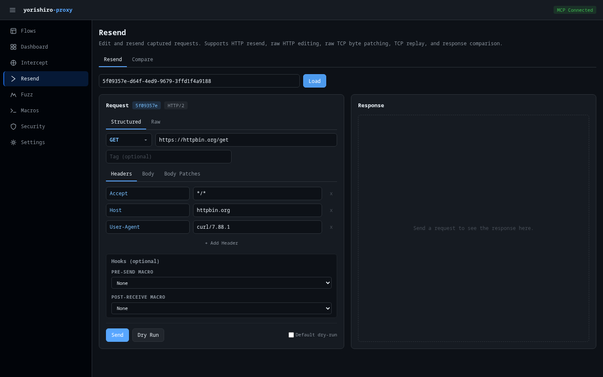

# Resender

The Resender page lets you edit and resend captured requests, supporting both HTTP and TCP protocols. You can modify any part of a request, preview changes with dry-run mode, and compare responses side by side.

## Page modes

The top of the page has two mode tabs:

- **Resend** -- The main request editor and sender
- **Compare** -- Side-by-side response comparison tool

## Loading a flow

To start resending, you need to load a captured flow:

1. Enter a flow ID in the input field (or navigate from the Flows page via the **Resend** button)
2. Click **Load** (or press Enter)

The editor populates with the flow's request data. The interface adapts based on the flow's protocol -- HTTP flows show an HTTP editor, TCP flows show a TCP editor.

## HTTP mode

When you load an HTTP or HTTPS flow, the editor presents a split-panel layout with the request editor on the left and response viewer on the right.

### Editor modes

Two editor mode tabs let you switch between:

- **Structured** -- Form-based editor with separate fields for method, URL, headers, and body
- **Raw** -- Full raw HTTP message editor for direct text editing

For HTTP/2 and gRPC flows, the structured editor works normally while the raw editor reconstructs an HTTP/1.1 representation with a notice about the downgrade.

### Structured editor

The structured editor provides:

#### Method and URL

A dropdown for the HTTP method (GET, POST, PUT, DELETE, PATCH, HEAD, OPTIONS) and a text input for the URL.

#### Tag

An optional tag field to label the resent request for later identification.

#### Request tabs

Three tabs organize the request editing:

- **Headers** -- Key-value editor for request headers. Add, modify, or remove individual headers.
- **Body** -- Textarea for the request body content.
- **Body patches** -- JSON patch editor for applying targeted modifications to the request body without rewriting it entirely. Each patch specifies a JSON path and replacement value.

#### Hooks

When macros are defined, a **Hooks** section appears allowing you to attach pre-send and post-receive hooks. These execute macro steps before sending the request or after receiving the response, enabling authentication token refresh and similar workflows.

#### Actions

- **Send** -- Sends the request (respects the dry-run toggle)
- **Dry Run** -- Generates a preview without actually sending the request
- **Default dry-run** -- Checkbox to make the Send button default to dry-run mode

### Raw editor

The raw editor provides:

- **Target address** -- `host:port` field (e.g., `example.com:443`)
- **TLS** -- Checkbox to enable TLS for the connection
- **Tag** -- Optional tag field
- **Raw HTTP text** -- Full editable HTTP message including request line, headers, and body
- **Send Raw** / **Dry Run** buttons

### Response viewer

The right panel displays the response after sending:

- Status code badge (color-coded by class)
- Duration in milliseconds
- Dry-run indicator when applicable
- Response headers and body with syntax highlighting

When no response is available yet, a placeholder message is shown.

## TCP mode

When you load a TCP flow, the editor switches to TCP mode with a different set of controls.

### TCP mode tabs

- **Resend Raw** -- Resend raw bytes with optional patches
- **TCP Replay** -- Replay all client messages in sequence

### TCP controls

- **Target address** -- `host:port` for the TCP connection target
- **TLS** -- Checkbox to enable TLS
- **Tag** -- Optional tag field

### Resend raw

In Resend Raw mode, two tabs are available:

- **Messages** -- Read-only list of original TCP messages showing direction (send/receive), size, and content
- **Raw Patches** -- Editor for applying byte-level patches to the raw TCP data before resending

Actions: **Send Raw**, **Dry Run**, and the dry-run toggle.

### TCP replay

TCP Replay re-sends all client (send) messages in their original sequence to the target address. No patching is applied -- this mode is useful for reproducing the exact original interaction.

Action: **Replay All** button.

### Response viewer

The TCP response viewer shows the raw response data with byte count and duration.

## Send history

Below the editor, a history list records all resend operations from the current session. Each entry shows:

- Status code or byte count badge
- HTTP method or RAW/REPLAY indicator
- Target URL or address
- Protocol badge (RAW, REPLAY)
- Dry-run indicator
- Tag (if set)
- Duration
- Timestamp

## Related pages

- [Resender feature](../features/resender.md) -- Detailed resender documentation
- [resend tool](../tools/resend.md) -- MCP tool reference
- [Comparer](../features/comparer.md) -- Response comparison feature
