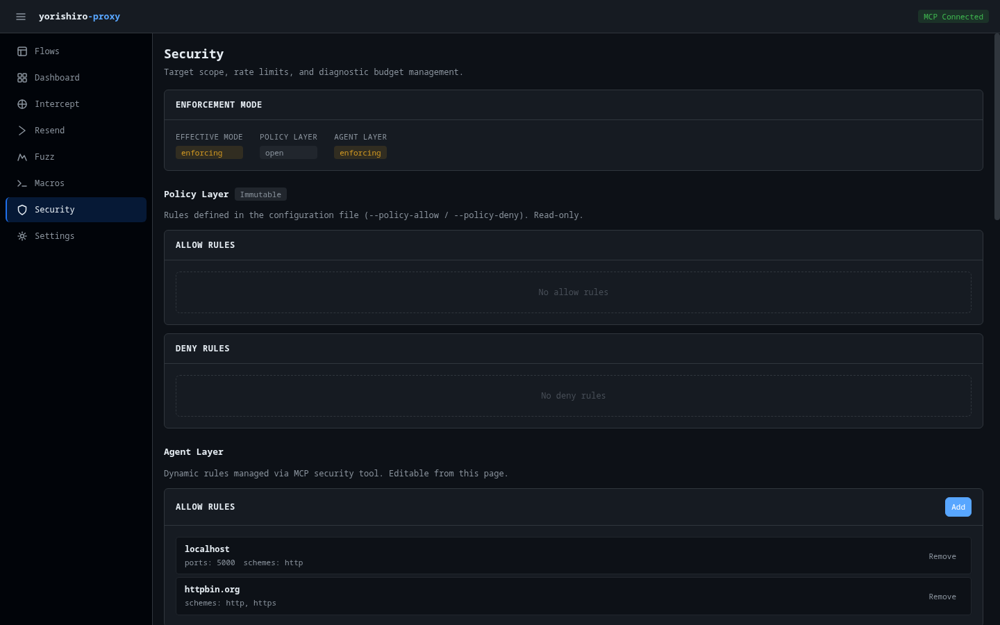

# Security

The Security page manages target scope rules, rate limits, diagnostic budgets, and SafetyFilter settings. It provides both read-only views of policy-level configuration and editable agent-level controls.

## Enforcement mode

At the top of the page, a card displays the enforcement mode for each security layer:

- **Effective mode** -- The combined mode that applies to all requests
- **Policy Layer** -- Mode derived from policy configuration (enforcing if any rules are defined, open otherwise)
- **Agent Layer** -- Mode derived from agent-managed rules

Each mode displays as a badge: **enforcing** (yellow) or **open** (default).

## Target scope

Target scope uses a two-layer model to control which hosts the proxy can interact with.

### Policy Layer

The Policy Layer shows rules defined in the configuration file via `--policy-allow` and `--policy-deny` flags. These rules are **read-only** and marked with an "Immutable" badge.

The layer displays two rule tables:

- **Allow rules** -- Hosts/patterns that are permitted
- **Deny rules** -- Hosts/patterns that are blocked

Each rule shows the hostname pattern, ports, path prefix, and scheme restrictions.

### Agent Layer

The Agent Layer shows dynamically managed rules that you can add or remove at runtime. Each rule table (Allow and Deny) has an **Add** button to create new rules.

#### Adding a rule

Click **Add** to open the rule form. Specify:

- **Hostname** -- The target hostname pattern (e.g., `*.example.com`)
- **Ports** -- Optional port restrictions
- **Path prefix** -- Optional URL path prefix filter
- **Schemes** -- Optional scheme restrictions (http, https)

#### Removing a rule

Each rule in the Agent Layer table has a remove button. Click it to delete the rule immediately.

## URL test tool

The URL Test section lets you check whether a specific URL would be allowed or denied by the current scope rules. Enter a full URL (e.g., `https://example.com/api/v1/resource`) and click **Test**.

The result shows:

- **Allowed** or **Denied** -- Color-coded badge (green for allowed, red for denied)
- **Layer** -- Which layer made the decision (policy or agent)
- **Reason** -- Explanation of why the URL was allowed or denied
- **Tested target** -- The parsed URL components (scheme, hostname, port, path)
- **Matched rule** -- The specific rule that matched, if any

## SafetyFilter

The SafetyFilter section displays input and output filter rules defined in the configuration. These rules are **read-only** and belong to the Policy Layer.

The header shows:

- **Enabled/Disabled** badge indicating whether the filter is active
- **Immutable** badge when the filter cannot be modified at runtime

Two rule tables are displayed:

### Input filter rules

Rules that inspect outgoing requests to prevent dangerous operations. Each rule shows:

- **Name** -- Rule identifier
- **Pattern** -- Regex or match pattern
- **Targets** -- Where the rule applies (header, body, URL, etc.)
- **Action** -- What happens when the rule matches (block, warn)
- **Category** -- Rule classification

### Output filter rules

Rules that filter incoming responses to redact sensitive data. Output rules additionally show:

- **Replacement** -- The text that replaces matched content

## Rate limits

The Rate Limits section manages request throughput controls using the two-layer model.

### Effective limits

Shows the combined limits that currently apply:

- **Global RPS** -- Maximum requests per second across all targets
- **Per-Host RPS** -- Maximum requests per second to any single host

### Policy Layer

Read-only display of rate limits from the configuration file (marked "Immutable").

### Agent Layer

Editable rate limits that you can adjust at runtime. Click **Edit** to modify:

- **Global RPS** -- Enter a value or leave blank for no limit
- **Per-Host RPS** -- Enter a value or leave blank for no limit

Click **Save** to apply or **Cancel** to discard changes.

## Diagnostic budget

The Budget section manages request and time limits for diagnostic sessions.

### Current usage

Shows real-time usage statistics:

- **Requests** -- Current request count with progress bar (when a max is set). The progress bar changes color at 70% (warning) and 90% (danger)
- **Duration limit** -- Maximum session duration
- **Stop reason** -- Displayed when the proxy was stopped due to budget exhaustion

Usage polls every 5 seconds.

### Effective limits

The combined budget limits currently in effect.

### Policy Layer

Read-only budget limits from the configuration file.

### Agent Layer

Editable budget overrides. Click **Edit** to modify:

- **Max total requests** -- Maximum number of requests allowed (whole number)
- **Max duration** -- Maximum session duration in Go duration format (e.g., `30m`, `1h`, `1h30m`)

Click **Save** to apply or **Cancel** to discard changes.

## Related pages

- [Target scope](../features/target-scope.md) -- Detailed target scope documentation
- [SafetyFilter](../features/safety-filter.md) -- SafetyFilter feature documentation
- [Rate limits & budgets](../features/rate-limits.md) -- Rate limiting documentation
- [security tool](../tools/security.md) -- MCP tool reference
- [Security model](../concepts/security-model.md) -- Security architecture concepts
