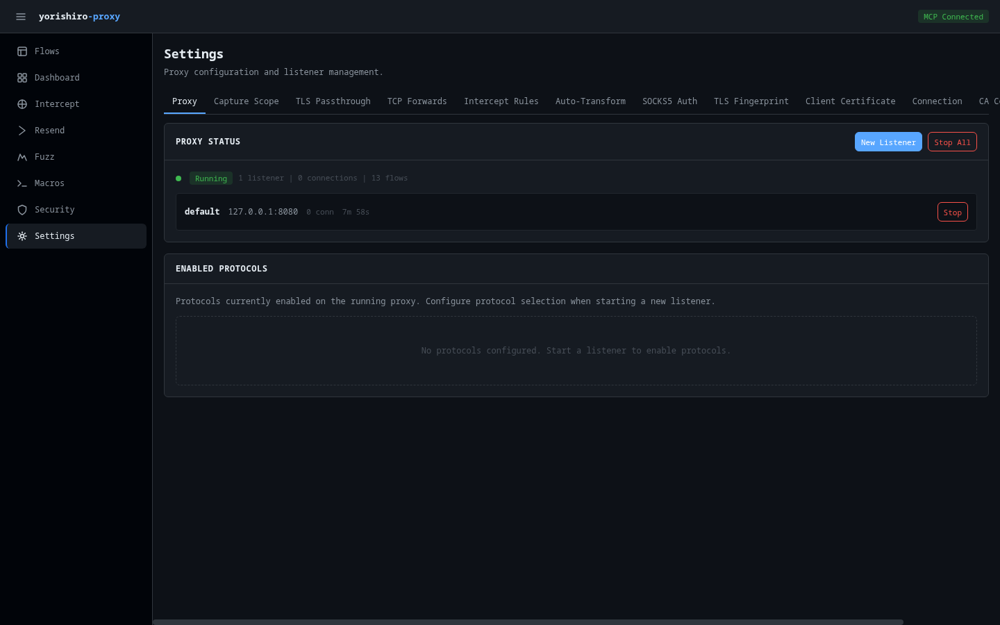

# Settings

The Settings page provides a tabbed interface for configuring all aspects of the proxy. It uses the MCP `configure`, `proxy_start`, and `proxy_stop` tools to apply changes.

## Tabs

The Settings page is organized into 12 tabs:

| Tab | Description |
|-----|-------------|
| **Proxy** | Listener management and protocol filters |
| **Capture Scope** | Control which traffic is captured |
| **TLS Passthrough** | Bypass MITM for specific hosts |
| **TCP Forwards** | Port forwarding rules |
| **Intercept Rules** | Request interception configuration |
| **Auto-Transform** | Automatic request/response modifications |
| **SOCKS5 Auth** | SOCKS5 authentication credentials |
| **TLS Fingerprint** | TLS fingerprinting settings |
| **Client Certificate** | mTLS client certificate configuration |
| **Connection** | Connection timeouts and limits |
| **CA Certificate** | CA certificate management |
| **Plugins** | Starlark plugin management |

## Proxy

The Proxy tab has two sections:

### Proxy control

Manage proxy listeners (start/stop). The panel shows currently running listeners with their name, listen address, active connection count, and uptime.

To start a new listener:

1. Click **Start New Listener** to reveal the form
2. Configure the listener:
    - **Name** -- Optional listener name
    - **Listen address** -- Address and port to bind (default: `127.0.0.1:8080`)
    - **Upstream proxy** -- Optional upstream proxy URL
    - **Protocols** -- Checkboxes to enable/disable individual protocols (HTTP/1.x, HTTPS, WebSocket, HTTP/2, gRPC, TCP). All are enabled by default.
3. Click **Start**

To stop a listener, click the **Stop** button next to it (with confirmation).

### Protocol filter

Enable or disable individual protocols for active listeners. This controls which protocol types the proxy will handle.

## Capture scope

Configure rules that determine which traffic is captured and stored. You can add include/exclude patterns to scope the capture to specific hosts, paths, or other criteria.

## TLS passthrough

Manage hosts that should bypass TLS interception (MITM). Connections to these hosts are forwarded directly without decrypting the traffic. Use this for:

- Certificate-pinned applications
- Hosts you don't need to inspect
- Services that break under MITM

You can add and remove passthrough rules from this tab.

## TCP forwards

Configure TCP port forwarding rules that map local ports to upstream targets. Each forward rule specifies:

- **Local port** -- The port to listen on (1--65535)
- **Upstream host** -- The target hostname (e.g., `db.example.com`)
- **Upstream port** -- The target port (1--65535)
- **Protocol** -- Protocol hint for L7 parsing:

    | Value | Description |
    |-------|-------------|
    | `auto` | Peek-based protocol detection (default) |
    | `raw` | No L7 parsing, forward raw bytes |
    | `http` | Force HTTP/1.x parsing |
    | `http2` | Force HTTP/2 parsing |
    | `grpc` | Force gRPC parsing (over HTTP/2) |
    | `websocket` | Force WebSocket frame parsing |

- **TLS termination** -- Checkbox to enable TLS MITM on the forwarded port. When checked, the proxy terminates TLS using the target hostname for certificate generation, then applies L7 parsing to the decrypted traffic.

TCP forwards are start-time configuration: they are applied when starting a new listener via `proxy_start`. Adding a forward restarts the proxy with the updated mapping set. To remove a forward, restart the proxy with the desired configuration.

Each configured forward is displayed in the mapping list with:

- A port badge (e.g., `:3306`)
- The upstream target (`host:port`)
- A protocol badge -- green for an explicit protocol, gray for `auto`
- A **TLS** badge (yellow) when TLS termination is enabled

This is useful for forwarding non-HTTP protocols (databases, gRPC services, custom TCP services) through the proxy for inspection.

## Intercept rules

Manage rules that determine which requests are intercepted and held for review. You can:

- Add new intercept rules
- Enable or disable existing rules
- Remove rules

Intercepted requests appear in the [Intercept](intercept.md) page queue.

## Auto-transform

Configure automatic request and response transformation rules. Auto-transform rules modify traffic in-flight without manual intervention. Each rule specifies match conditions and transformations to apply.

## SOCKS5 auth

Configure SOCKS5 proxy authentication credentials. When the proxy operates as a SOCKS5 server, you can set username/password requirements for connecting clients.

## TLS fingerprint

View and configure TLS fingerprinting settings. TLS fingerprinting adjusts the proxy's TLS Client Hello to mimic specific browsers or applications, helping avoid detection by WAFs or bot protection systems.

## Client certificate

Configure mTLS client certificates for connections to upstream servers that require mutual TLS authentication. You can set:

- Client certificate file path
- Client private key file path

## Connection

View and modify connection settings:

- **Listen address** -- Current proxy listen address
- **Upstream proxy** -- Upstream proxy configuration
- **Max connections** -- Maximum concurrent connection limit
- **Peek timeout** -- Protocol detection timeout in milliseconds
- **Request timeout** -- HTTP request timeout in milliseconds

## CA certificate

Manage the proxy's Certificate Authority used for TLS interception:

- **View certificate details** -- Subject, issuer, validity dates, and serial number
- **Download CA certificate** -- Download the root CA certificate in PEM format for installation in your operating system or browser trust store
- **Installation instructions** -- Platform-specific guides for macOS, Windows, Linux, Firefox, and Android
- **Regenerate CA** -- Generate a new CA certificate (requires reinstallation in trust stores)

!!! warning
    Regenerating the CA certificate invalidates all previously installed certificates. You will need to reinstall the new CA certificate on all devices.

## Plugins

Manage Starlark plugins loaded into the proxy:

- **Plugin list** -- Shows all loaded plugins with their name, status (enabled/disabled), and file path
- **Enable/Disable** -- Toggle individual plugins on or off
- **Reload** -- Reload a plugin's Starlark script from disk to pick up changes

## Related pages

- [CLI flags](../configuration/cli-flags.md) -- Command-line configuration reference
- [Config file](../configuration/config-file.md) -- Configuration file reference
- [TLS configuration](../configuration/tls.md) -- TLS setup guide
- [CA certificate](../getting-started/ca-certificate.md) -- CA certificate installation guide
- [proxy_start tool](../tools/proxy-start.md) -- MCP tool for starting listeners
- [configure tool](../tools/configure.md) -- MCP tool for configuration changes
- [plugin tool](../tools/plugin.md) -- MCP tool for plugin management
